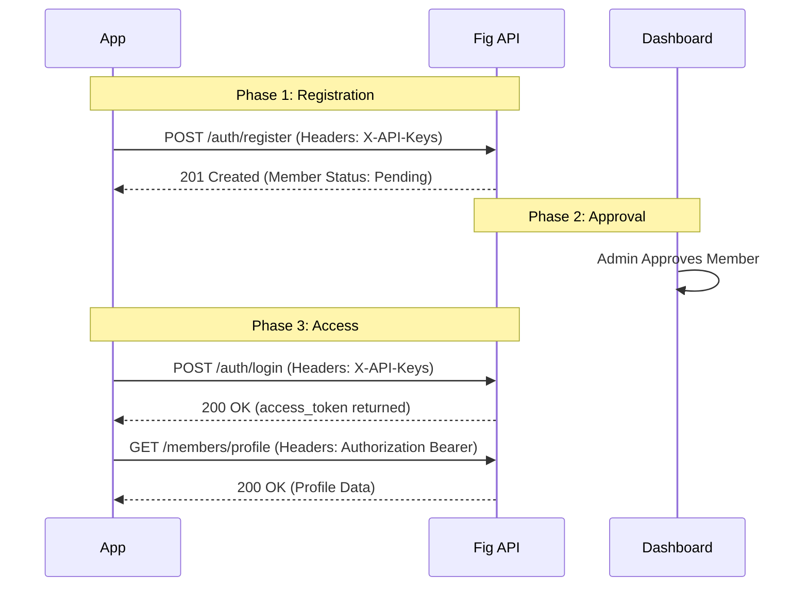

To interact with the Fig Finance Member API, you must use two types of security credentials depending on the endpoint: **Branch Keys** and **JWT Access Tokens**.

## Authentication Methods

### 1. Branch Keys (API Keys)
These are used for initial requests where a member is not yet logged in, such as Registration and Login.

Include these in your request headers:

| Header | Value |
| :--- | :--- |
| `X-API-Key` | Your public branch key (e.g., `pk_...`) |
| `X-API-Secret` | Your secret branch key (e.g., `sk_...`) |

### 2. JWT Access Tokens (Member Auth)
Once a member has logged in, most endpoints require a JSON Web Token (JWT) for user-level authorization.

Include the token in your headers using the Bearer scheme:

| Header | Value |
| :--- | :--- |
| `Authorization` | `Bearer {jwt_token}` |

<Info>
  **Token Lifetime**: JWT tokens are valid for **1 hour** (3,600 seconds). You can refresh an active token using the `/auth/refresh` endpoint to get an additional 1 hour without requiring the user to log in again.
</Info>

## Authentication Flow

## Error Codes

| Code | Meaning |
| :--- | :--- |
| `401 Unauthorized` | Missing or invalid Branch Keys or JWT Token. |
| `403 Forbidden` | The user is authenticated but doesn't have permission for this action (e.g., member is still Pending approval). |
